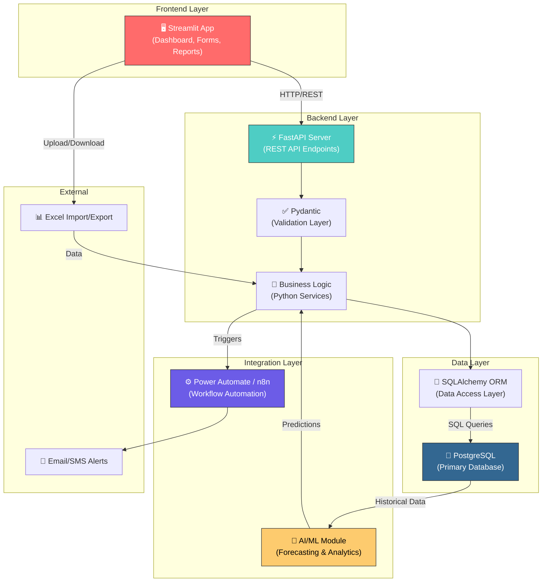
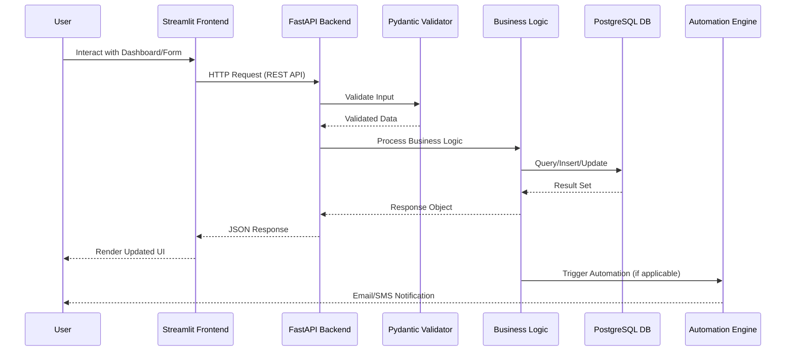
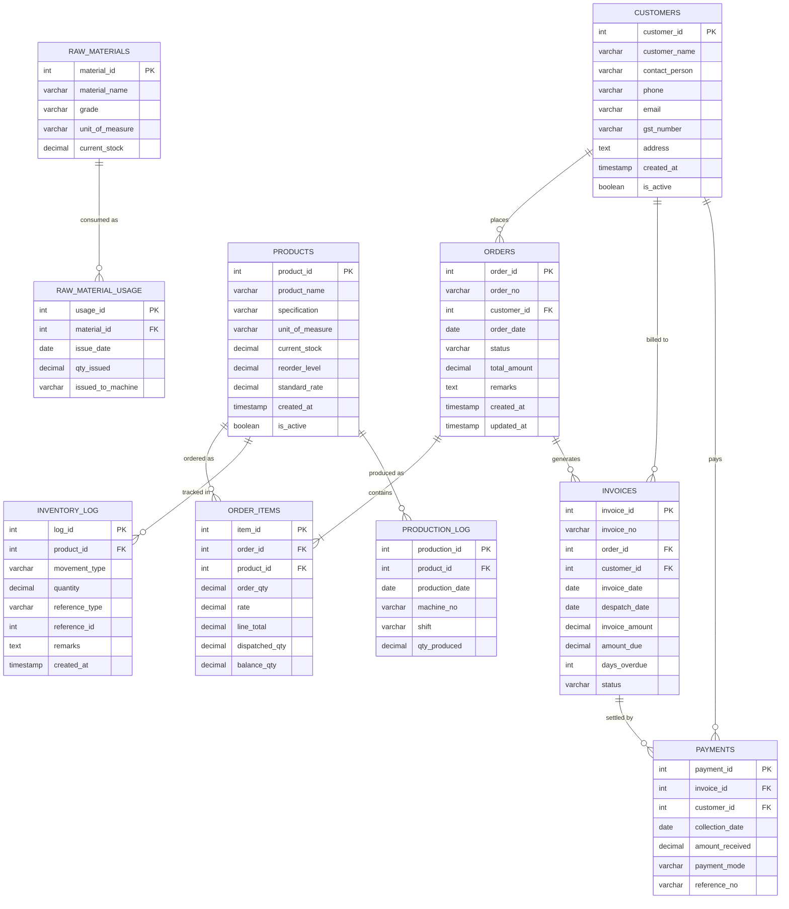
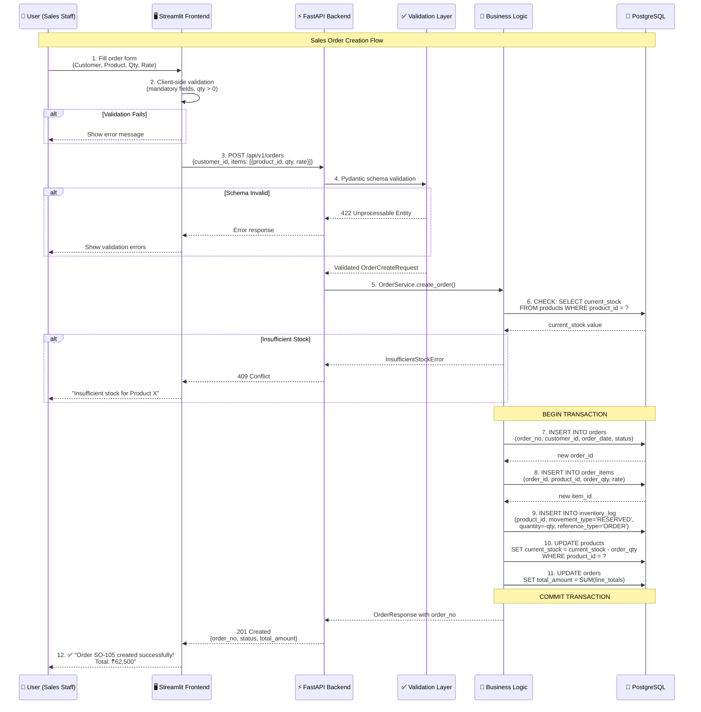
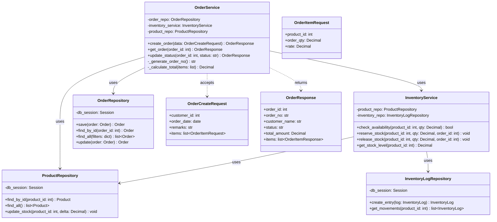

# Amba Enterprises Limited — ERP System Design & Strategy Document

**Prepared by:** Panav Jogi  
**Date:** March 3, 2026  
**Challenge:** Stage 2 — The ERP System Design & Strategy Challenge

---
## 🎥 Prototype Demo

https://github.com/panav-22/ael-task/raw/main/demo.mov

---

## Table of Contents

1. [Company Research & Initial Assessment](#1-company-research--initial-assessment)
2. [Build vs. Buy Strategy](#2-build-vs-buy-strategy)
3. [System Architecture & Technology Stack](#3-system-architecture--technology-stack)
4. [Data Modeling Document](#4-data-modeling-document)
5. [Detailed Implementation Flow — Sales Order Creation](#5-detailed-implementation-flow--sales-order-creation)

---

# 1. Company Research & Initial Assessment

## About Amba Enterprises Limited

Amba Enterprises Limited (AEL) is a **BSE-listed Indian public company** (Scrip Code: 539196, CIN: L99999PN1992PLC198612) headquartered in Mumbai with its registered office in Pune, Maharashtra. Incorporated in 1992, the company specializes in **power engineering solutions**, specifically:

- **Transformer core laminations** (CRNGO/CRNO strips)
- **Stampings** for generators, alternators, motors, and pumps
- **Die-cast rotors**, toroidal cores, and slit/full coils

With a manufacturing capacity of approximately **3,500 metric tons per year**, AEL is one of India's largest manufacturers of transformer core laminations. The company reported **revenue of ₹337 Crore (FY 2025)** with a 19.28% YoY growth rate and a net worth of ₹42.50 Crore. Despite its scale, the company operates with a lean workforce of approximately **13 employees**, indicating heavy reliance on automated/semi-automated manufacturing processes and outsourced functions.

AEL serves downstream industries including **UPS systems, energy distribution, transformers, automobiles, and general engineering/appliances**. The company maintains direct relationships with steel mills for competitive raw material pricing.

## Analysis of the Management Report (Excel)

The provided Excel management report contains **8 operational worksheets**, each representing a distinct business function currently managed in isolation:

| Sheet | Function | Sample Records |
|-------|----------|----------------|
| Customer Profitability Summary | Customer-level revenue vs. collection tracking | 5 customers |
| Sales Order (Sample) | Order booking with product, qty, rate | 4 orders |
| Order Balance Report | Ordered vs. dispatched vs. pending quantities | 4 records |
| Production Report | Daily production by machine and shift | 4 records |
| Despatches Report | Goods dispatch with invoice references | 3 records |
| Raw Material Used | Material consumption by machine | 4 records |
| Outstanding Report (as of 31-Jul) | Aging of unpaid invoices | 4 records |
| Customer Collection Report | Payment receipts with mode and reference | 3 records |

## Top 3 Pain Points — Justification

### Pain Point #1: No Real-Time Inventory Visibility (Blind Spots in Stock)

**Evidence:** The Production Report, Despatches Report, and Raw Material Used sheets exist as **completely independent, disconnected sheets**. There is no running stock balance, no real-time inventory ledger, and no mechanism to calculate current stock by combining production inflows and dispatch outflows.

For example, "Product A - 10mm" has:
- **2,000 units produced** (Production Report, July 5)
- **2,000 units dispatched** against SO-101 (Despatches Report, July 6)
- But there is **no sheet showing the resulting stock level** of 0 units

This means the operations team has **no single source of truth** for current inventory. They must manually cross-reference multiple sheets to determine whether they can fulfill a new order — a process prone to human error.

**Business Impact:**
- **Risk of overcommitting** to customers when stock is insufficient
- **Overproduction** of items already in surplus due to lack of visibility
- **Raw material wastage** — 1,800 kg of Steel Coil Grade X was issued to Machine M-01 (July 5) to produce 2,000 units of Product A, but there's no tracking of material yield/wastage rates
- Direct **revenue loss** from delayed or cancelled orders due to stock miscalculations

---

### Pain Point #2: Manual & Disconnected Outstanding/Collections Tracking (Cash Flow Risk)

**Evidence:** The Outstanding Report and Customer Collection Report are maintained as **separate disconnected sheets** with no automatic reconciliation. Critical findings from the data:

| Customer | Invoice Amount | Outstanding | Days Overdue | Collections | Status |
|----------|---------------|-------------|-------------|-------------|--------|
| Customer 2 | ₹1,05,000 | ₹1,05,000 | 23 days | ₹0 | **⚠️ Zero payment, no follow-up indicator** |
| Customer 4 | ₹75,000 | ₹25,000 | 46 days | ₹50,000 | Partial payment received |
| Customer 1 | ₹25,000 | ₹25,000 | 25 days | ₹10,000 (July 30) | Only ₹10,000 against ₹1,67,500 total orders |

Customer 2 shows ₹1,05,000 outstanding with **zero collections and no last payment date**, yet there's no automated alert or aging escalation mechanism. With total outstanding of ₹3,30,000 across just 5 customers, this represents a significant **working capital blockage** for a company with ₹42.5 Cr net worth.

**Business Impact:**
- **Cash flow crunch** — inability to auto-track aging receivables means overdue payments slip through
- **No automated dunning** — payment reminders are purely manual
- **Cannot produce a real-time DSO (Days Sales Outstanding) metric** — critical for a manufacturing company's financial health
- Risk of **bad debt** from customers like Customer 2 and Customer 3 (₹37,500 outstanding, zero collections)

---

### Pain Point #3: No Order-to-Delivery Traceability (Broken Supply Chain Visibility)

**Evidence:** The Sales Order, Order Balance, Production Report, and Despatches Report sheets have **no referential linking**. Consider the lifecycle of SO-103:

| Stage | Data | Status |
|-------|------|--------|
| **Order** | SO-103, Customer 3, Product C - Special, 1,500 qty @ ₹25 | ✅ Booked |
| **Production** | *No production record exists for "Product C - Special"* | ❌ Not started |
| **Despatch** | *No despatch record exists for SO-103* | ❌ Not shipped |
| **Order Balance** | 1,500 ordered, 0 dispatched, 1,500 balance | ⚠️ Fully pending |

There is **no way to determine** from the Excel:
- Has production been scheduled for SO-103?
- Which machine will produce "Product C - Special"?
- What is the estimated delivery date?
- Has raw material been allocated?

Similarly, SO-104 (Product A - 15mm, 7,500 qty) shows 5,000 dispatched and 2,500 pending, but the Production Report shows 5,000 units produced (July 6, M-02, Night shift). **There is no link between order → production → despatch** to confirm that the 5,000 produced units were indeed the ones dispatched against SO-104.

**Business Impact:**
- **Cannot provide customers with delivery ETAs** — sales team operates blind
- **No production scheduling linked to order priority** — high-value orders may be delayed while low-priority items are produced
- **No material requirement planning (MRP)** — cannot auto-calculate raw material needs based on pending orders
- **Customer dissatisfaction and potential order cancellation** — especially critical for AEL's B2B customers who are themselves manufacturers

---

# 2. Build vs. Buy Strategy

## Recommendation: **BUILD** (Custom Python/Streamlit ERP)

For Amba Enterprises Limited's specific context — a **13-employee, ₹337 Cr manufacturing company** transitioning from Excel-only operations — we recommend **building a custom ERP system** using Python/Streamlit rather than adopting an open-source ERP like ERPNext or Odoo.

## Value/Effort Justification

### Comparative Analysis

| Decision Factor | 🔨 BUILD (Python/Streamlit) | 🛒 BUY (ERPNext) | 🛒 BUY (Odoo Enterprise) |
|----------------|---------------------------|-------------------|------------------------|
| **Licensing Cost** | ₹0 (fully open-source stack) | ₹0 (open-source) | ~₹27,000/user/year (~$25/user/mo × 13 users = $3,900/yr) |
| **Infrastructure** | ₹5,000-10,000/mo (VPS) | ₹12,000-20,000/mo (Frappe Cloud) or self-hosted | ₹20,000-35,000/mo (Odoo.sh) |
| **Implementation Time** | 4-6 weeks (core modules) | 2-4 weeks base + 4-8 weeks customization | 2-4 weeks base + 6-12 weeks customization |
| **Customization Effort** | Full control — build exactly what AEL needs | Frappe framework customization — moderate learning curve | Odoo Studio (no-code) + Python modules — steep for niche requirements |
| **Fit to AEL Workflow** | ⭐ **100%** — built around AEL's lamination-specific BOM, machine-shift production model | ~70% — ERPNext manufacturing module is generic, needs heavy customization for shift-based production, lamination-grade tracking | ~65% — Odoo manufacturing is comprehensive but over-featured for 13 users |
| **Training Required** | Minimal — simple Streamlit UI, familiar to Excel users | 2-4 weeks — multiple modules, complex navigation | 3-6 weeks — extensive module ecosystem |
| **Maintenance Burden** | Requires 1 developer (part-time) | Community updates may break customizations | Vendor-managed but upgrade cycles may conflict with custom modules |
| **GST/TDS Compliance** | Must build — but straightforward with Python libraries | Built-in Indian compliance modules | Built-in but Enterprise edition required |
| **Scalability** | Good up to ~50 concurrent users, then needs architectural upgrade | Excellent — handles 100+ users natively | Excellent — enterprise-grade scaling |

### Why BUILD wins for AEL

**1. Right-Sized Solution for a Lean Team**  
With only 13 employees, AEL doesn't need the 30+ modules that ERPNext or Odoo provide (HR, CRM, helpdesk, website builder, etc.). A custom build delivers the **5-6 core modules** (Orders, Inventory, Production, Dispatch, Collections, Reports) without the overhead of unused features.

**2. Domain-Specific Manufacturing Logic**  
AEL's production model is **niche** — transformer lamination manufacturing involves:
- Machine-specific production (M-01, M-02) with day/night shifts
- Raw material tracking by grade (Steel Coil Grade X/Y/Z, Aluminum Sheet)
- Product specifications by dimension (10mm, 15mm, 20mm) and type (Special)

ERPNext's generic manufacturing BOM would require significant customization to handle shift-based production logging and grade-specific material consumption tracking.

**3. Total Cost of Ownership (3-Year Projection)**

| Cost Component | BUILD | ERPNext (Self-Hosted) | Odoo Enterprise |
|---------------|-------|----------------------|-----------------|
| Year 1: Setup + Development | ₹3,00,000 | ₹2,00,000 (implementation partner) | ₹5,00,000 (Odoo partner) |
| Year 1: Infrastructure | ₹1,20,000 | ₹2,40,000 | ₹4,20,000 |
| Year 1: Licensing | ₹0 | ₹0 | ₹3,51,000 |
| Year 2-3: Maintenance | ₹2,40,000 | ₹3,60,000 | ₹4,80,000 |
| Year 2-3: Infrastructure | ₹2,40,000 | ₹4,80,000 | ₹8,40,000 |
| Year 2-3: Licensing | ₹0 | ₹0 | ₹7,02,000 |
| **3-Year TCO** | **₹9,00,000** | **₹12,80,000** | **₹32,93,000** |

**4. Migration Path**  
The proposed data model (PostgreSQL, normalized schema) is intentionally designed to be **ERPNext-compatible**. If AEL scales beyond 50 employees or needs advanced modules (HR/Payroll/CRM) in the future, the data can be migrated to ERPNext with moderate effort.

> **Bottom Line:** BUILD for now, with an optional MIGRATE path to ERPNext for future growth.

---

# 3. System Architecture & Technology Stack

## Full Technology Stack

| Layer | Technology | Version | Justification |
|-------|-----------|---------|---------------|
| **Frontend** | **Streamlit** | 1.40+ | Python-native rapid UI development; ideal for data dashboards; zero JavaScript needed; built-in widgets for forms, tables, charts; free cloud hosting |
| **Backend API** | **FastAPI** | 0.115+ | Async Python framework; automatic OpenAPI docs; Pydantic validation; excellent performance; easy to couple with Streamlit |
| **Database** | **PostgreSQL** | 16+ | ACID-compliant relational DB; handles concurrent multi-user access; excellent indexing and query optimization; free; scales to millions of rows; JSONB support for flexible metadata |
| **ORM** | **SQLAlchemy** | 2.0+ | Python ORM with migration support (Alembic); type-safe query building; database-agnostic if future migration needed |
| **Automation** | **Power Automate** / **n8n** | Latest | Low-code workflow automation for email alerts (overdue payments, low stock), scheduled report generation, integration with Microsoft 365 |
| **AI/ML** | **Python (scikit-learn, Prophet)** | Latest | Demand forecasting for production planning; anomaly detection on production quality data; customer payment prediction |
| **Deployment** | **Streamlit Cloud** (prototype) → **Docker + VPS** (production) | - | Free tier for prototype demo; Docker containers for production reliability and portability |
| **Version Control** | **Git + GitHub** | - | Source code management, CI/CD pipeline, collaboration |

## Database Choice Justification — PostgreSQL

| Criterion | PostgreSQL | SQLite | MongoDB (NoSQL) |
|-----------|-----------|--------|-----------------|
| **Multi-user Concurrency** | ✅ Row-level locking, MVCC | ❌ File-level lock, single writer | ✅ Document-level locking |
| **ACID Compliance** | ✅ Full ACID | ⚠️ Limited WAL mode | ⚠️ Multi-document transactions added recently |
| **Relational Integrity** | ✅ FK constraints, CHECK, UNIQUE | ✅ Basic FK support | ❌ No enforced schema |
| **Scalability** | ✅ Handles millions of rows, partitioning | ❌ Not designed for >1GB databases | ✅ Horizontal sharding |
| **Cost** | ✅ Free & open source | ✅ Free, embedded | ✅ Free community edition |
| **ERP Data Fit** | ✅ Perfect for relational order→customer→product data | ⚠️ Prototype only | ❌ ERP data is inherently relational |
| **Indian Hosting** | ✅ Available on all Indian cloud providers | N/A | ✅ MongoDB Atlas India region |

**Verdict:** PostgreSQL is the clear winner for a manufacturing ERP — the data is inherently relational (orders reference customers and products), ACID compliance is critical for financial transactions, and the cost is zero.

## System Architecture Diagram



### Component Interaction Flow



---

# 4. Data Modeling Document

## Entity-Relationship Overview



## SQL DDL Schema Definition

```sql
-- ============================================================
-- AEL ERP Database Schema — PostgreSQL DDL
-- ============================================================

-- 1. CUSTOMERS (Master Data)
-- Maps to: "Customer Profitability Summary" and "Customer Collection Report" sheets
CREATE TABLE customers (
    customer_id     SERIAL PRIMARY KEY,
    customer_name   VARCHAR(200) NOT NULL,
    contact_person  VARCHAR(200),
    phone           VARCHAR(20),
    email           VARCHAR(200),
    gst_number      VARCHAR(15),          -- 15-char Indian GSTIN
    address         TEXT,
    created_at      TIMESTAMP DEFAULT CURRENT_TIMESTAMP,
    is_active       BOOLEAN DEFAULT TRUE,

    CONSTRAINT uq_customer_name UNIQUE (customer_name),
    CONSTRAINT chk_gst_format CHECK (
        gst_number IS NULL OR LENGTH(gst_number) = 15
    )
);

-- 2. PRODUCTS (Master Data / Inventory)
-- Maps to: Products referenced across Sales Order, Production, and Despatch sheets
CREATE TABLE products (
    product_id       SERIAL PRIMARY KEY,
    product_name     VARCHAR(200) NOT NULL,   -- e.g., "Product A"
    specification    VARCHAR(100),            -- e.g., "10mm", "15mm", "20mm", "Special"
    unit_of_measure  VARCHAR(20) DEFAULT 'units',
    current_stock    DECIMAL(12,2) DEFAULT 0,
    reorder_level    DECIMAL(12,2) DEFAULT 0,
    standard_rate    DECIMAL(10,2),
    created_at       TIMESTAMP DEFAULT CURRENT_TIMESTAMP,
    is_active        BOOLEAN DEFAULT TRUE,

    CONSTRAINT uq_product_spec UNIQUE (product_name, specification),
    CONSTRAINT chk_stock_non_negative CHECK (current_stock >= 0),
    CONSTRAINT chk_reorder_non_negative CHECK (reorder_level >= 0)
);

-- 3. ORDERS (Transactional Data)
-- Maps to: "Sales Order (Sample)" sheet
CREATE TABLE orders (
    order_id        SERIAL PRIMARY KEY,
    order_no        VARCHAR(20) NOT NULL UNIQUE,  -- e.g., "SO-101"
    customer_id     INTEGER NOT NULL,
    order_date      DATE NOT NULL,
    status          VARCHAR(20) DEFAULT 'Pending'
                        CHECK (status IN ('Pending', 'In Production',
                               'Partially Dispatched', 'Fully Dispatched',
                               'Cancelled')),
    total_amount    DECIMAL(14,2) DEFAULT 0,
    remarks         TEXT,
    created_at      TIMESTAMP DEFAULT CURRENT_TIMESTAMP,
    updated_at      TIMESTAMP DEFAULT CURRENT_TIMESTAMP,

    CONSTRAINT fk_order_customer
        FOREIGN KEY (customer_id)
        REFERENCES customers(customer_id)
        ON DELETE RESTRICT
);

-- 4. ORDER_ITEMS (Line Items for each Order)
-- Maps to: individual rows in "Sales Order (Sample)" — each row is an item in an order
CREATE TABLE order_items (
    item_id         SERIAL PRIMARY KEY,
    order_id        INTEGER NOT NULL,
    product_id      INTEGER NOT NULL,
    order_qty       DECIMAL(12,2) NOT NULL,
    rate            DECIMAL(10,2) NOT NULL,
    line_total      DECIMAL(14,2) GENERATED ALWAYS AS (order_qty * rate) STORED,
    dispatched_qty  DECIMAL(12,2) DEFAULT 0,
    balance_qty     DECIMAL(12,2) GENERATED ALWAYS AS (order_qty - dispatched_qty) STORED,

    CONSTRAINT fk_item_order
        FOREIGN KEY (order_id)
        REFERENCES orders(order_id)
        ON DELETE CASCADE,
    CONSTRAINT fk_item_product
        FOREIGN KEY (product_id)
        REFERENCES products(product_id)
        ON DELETE RESTRICT,
    CONSTRAINT chk_order_qty_positive CHECK (order_qty > 0),
    CONSTRAINT chk_rate_positive CHECK (rate > 0),
    CONSTRAINT chk_dispatched_valid CHECK (dispatched_qty >= 0 AND dispatched_qty <= order_qty)
);

-- 5. INVENTORY_LOG (Stock Movement Ledger/Journal)
-- This is the KEY table solving Pain Point #1 — every stock movement is logged
CREATE TABLE inventory_log (
    log_id          SERIAL PRIMARY KEY,
    product_id      INTEGER NOT NULL,
    movement_type   VARCHAR(20) NOT NULL
                        CHECK (movement_type IN ('PRODUCTION', 'DISPATCH',
                               'RESERVED', 'ADJUSTMENT', 'RETURN')),
    quantity         DECIMAL(12,2) NOT NULL,  -- positive = inflow, negative = outflow
    reference_type   VARCHAR(30),             -- 'ORDER', 'INVOICE', 'PRODUCTION', 'MANUAL'
    reference_id     INTEGER,                 -- ID of the related order/invoice/production record
    remarks          TEXT,
    created_at       TIMESTAMP DEFAULT CURRENT_TIMESTAMP,

    CONSTRAINT fk_invlog_product
        FOREIGN KEY (product_id)
        REFERENCES products(product_id)
        ON DELETE RESTRICT,
    CONSTRAINT chk_quantity_nonzero CHECK (quantity != 0)
);

-- 6. INVOICES (Despatch + Billing Records)
-- Maps to: "Despatches Report" + "Outstanding Report" sheets
CREATE TABLE invoices (
    invoice_id      SERIAL PRIMARY KEY,
    invoice_no      VARCHAR(20) NOT NULL UNIQUE,  -- e.g., "INV-501"
    order_id        INTEGER,
    customer_id     INTEGER NOT NULL,
    invoice_date    DATE NOT NULL,
    despatch_date   DATE,
    invoice_amount  DECIMAL(14,2) NOT NULL,
    amount_due      DECIMAL(14,2) NOT NULL,
    days_overdue    INTEGER DEFAULT 0,
    status          VARCHAR(20) DEFAULT 'Unpaid'
                        CHECK (status IN ('Unpaid', 'Partially Paid', 'Paid')),

    CONSTRAINT fk_invoice_order
        FOREIGN KEY (order_id)
        REFERENCES orders(order_id)
        ON DELETE SET NULL,
    CONSTRAINT fk_invoice_customer
        FOREIGN KEY (customer_id)
        REFERENCES customers(customer_id)
        ON DELETE RESTRICT,
    CONSTRAINT chk_invoice_amount_positive CHECK (invoice_amount > 0),
    CONSTRAINT chk_due_non_negative CHECK (amount_due >= 0)
);

-- 7. PAYMENTS (Customer Collection Records)
-- Maps to: "Customer Collection Report" sheet
CREATE TABLE payments (
    payment_id      SERIAL PRIMARY KEY,
    invoice_id      INTEGER,
    customer_id     INTEGER NOT NULL,
    collection_date DATE NOT NULL,
    amount_received DECIMAL(14,2) NOT NULL,
    payment_mode    VARCHAR(30)
                        CHECK (payment_mode IN ('Bank Transfer', 'Cheque',
                               'Cash', 'UPI', 'NEFT', 'RTGS')),
    reference_no    VARCHAR(50),             -- e.g., "BT-9876", "CHQ-12345"

    CONSTRAINT fk_payment_invoice
        FOREIGN KEY (invoice_id)
        REFERENCES invoices(invoice_id)
        ON DELETE SET NULL,
    CONSTRAINT fk_payment_customer
        FOREIGN KEY (customer_id)
        REFERENCES customers(customer_id)
        ON DELETE RESTRICT,
    CONSTRAINT chk_payment_positive CHECK (amount_received > 0)
);

-- 8. PRODUCTION_LOG (Production Tracking)
-- Maps to: "Production Report (Sample)" sheet
CREATE TABLE production_log (
    production_id   SERIAL PRIMARY KEY,
    product_id      INTEGER NOT NULL,
    production_date DATE NOT NULL,
    machine_no      VARCHAR(20) NOT NULL,    -- e.g., "M-01", "M-02"
    shift           VARCHAR(10) NOT NULL
                        CHECK (shift IN ('Day', 'Night')),
    qty_produced    DECIMAL(12,2) NOT NULL,

    CONSTRAINT fk_prod_product
        FOREIGN KEY (product_id)
        REFERENCES products(product_id)
        ON DELETE RESTRICT,
    CONSTRAINT chk_qty_produced_positive CHECK (qty_produced > 0)
);

-- 9. RAW_MATERIALS (Raw Material Master)
CREATE TABLE raw_materials (
    material_id     SERIAL PRIMARY KEY,
    material_name   VARCHAR(200) NOT NULL,   -- e.g., "Steel Coil Grade X"
    grade           VARCHAR(50),
    unit_of_measure VARCHAR(20) DEFAULT 'kg',
    current_stock   DECIMAL(12,2) DEFAULT 0,

    CONSTRAINT uq_material_name UNIQUE (material_name)
);

-- 10. RAW_MATERIAL_USAGE (Material Consumption)
-- Maps to: "Raw Material Used (Sample)" sheet
CREATE TABLE raw_material_usage (
    usage_id         SERIAL PRIMARY KEY,
    material_id      INTEGER NOT NULL,
    issue_date       DATE NOT NULL,
    qty_issued       DECIMAL(12,2) NOT NULL,
    issued_to_machine VARCHAR(20),           -- e.g., "M-01"

    CONSTRAINT fk_rmu_material
        FOREIGN KEY (material_id)
        REFERENCES raw_materials(material_id)
        ON DELETE RESTRICT,
    CONSTRAINT chk_qty_issued_positive CHECK (qty_issued > 0)
);

-- ============================================================
-- INDEXES — Performance Optimization
-- ============================================================

-- Orders: Frequently queried by customer and date range
CREATE INDEX idx_orders_customer_id ON orders(customer_id);
CREATE INDEX idx_orders_order_date ON orders(order_date);
CREATE INDEX idx_orders_status ON orders(status);

-- Order Items: JOINed with orders and products constantly
CREATE INDEX idx_order_items_order_id ON order_items(order_id);
CREATE INDEX idx_order_items_product_id ON order_items(product_id);

-- Inventory Log: The most queried table — stock calculations, audits
CREATE INDEX idx_invlog_product_id ON inventory_log(product_id);
CREATE INDEX idx_invlog_created_at ON inventory_log(created_at);
CREATE INDEX idx_invlog_movement_type ON inventory_log(movement_type);
CREATE INDEX idx_invlog_reference ON inventory_log(reference_type, reference_id);

-- Invoices: Queried for outstanding reports, aging analysis
CREATE INDEX idx_invoices_customer_id ON invoices(customer_id);
CREATE INDEX idx_invoices_status ON invoices(status);
CREATE INDEX idx_invoices_invoice_date ON invoices(invoice_date);

-- Payments: Queried for collection reports, reconciliation
CREATE INDEX idx_payments_customer_id ON payments(customer_id);
CREATE INDEX idx_payments_collection_date ON payments(collection_date);

-- Production Log: Queried for production reports by date, machine, product
CREATE INDEX idx_prodlog_product_id ON production_log(product_id);
CREATE INDEX idx_prodlog_date ON production_log(production_date);
CREATE INDEX idx_prodlog_machine ON production_log(machine_no);

-- Raw Material Usage: Queried for material consumption analysis
CREATE INDEX idx_rmu_material_id ON raw_material_usage(material_id);
CREATE INDEX idx_rmu_issue_date ON raw_material_usage(issue_date);
```

### Index Justification

| Index | Column(s) | Why? |
|-------|----------|------|
| `idx_orders_customer_id` | `orders.customer_id` | All customer-centric queries (customer profitability, order history) JOIN on this column |
| `idx_orders_order_date` | `orders.order_date` | Date-range queries for monthly/weekly sales reports |
| `idx_orders_status` | `orders.status` | Dashboard queries filtering by order status (Pending, In Production, etc.) |
| `idx_order_items_product_id` | `order_items.product_id` | Product demand analysis, inventory reservation checks |
| `idx_invlog_product_id` | `inventory_log.product_id` | **Most critical** — calculating current stock requires summing all movements for a product |
| `idx_invlog_created_at` | `inventory_log.created_at` | Time-based inventory audit trails, stock-at-date calculations |
| `idx_invlog_movement_type` | `inventory_log.movement_type` | Filtering movements (only PRODUCTION, only DISPATCH) for specific reports |
| `idx_invoices_status` | `invoices.status` | Outstanding/overdue report generation — filters unpaid invoices |
| `idx_invoices_customer_id` | `invoices.customer_id` | Customer-wise outstanding analysis, aging reports |
| `idx_prodlog_date` | `production_log.production_date` | Daily/weekly production reports |

---

# 5. Detailed Implementation Flow — Sales Order Creation

## Workflow Diagram — Sequential Steps



## REST API Endpoints

### `POST /api/v1/orders` — Create New Sales Order

**Request:**
```json
{
    "customer_id": 1,
    "order_date": "2025-07-10",
    "remarks": "Urgent delivery required",
    "items": [
        {
            "product_id": 1,
            "order_qty": 5000,
            "rate": 12.50
        },
        {
            "product_id": 3,
            "order_qty": 1000,
            "rate": 25.00
        }
    ]
}
```

**Success Response (201 Created):**
```json
{
    "order_id": 5,
    "order_no": "SO-105",
    "customer_id": 1,
    "customer_name": "Customer 1",
    "order_date": "2025-07-10",
    "status": "Pending",
    "total_amount": 87500.00,
    "items": [
        {
            "item_id": 5,
            "product_name": "Product A - 10mm",
            "order_qty": 5000,
            "rate": 12.50,
            "line_total": 62500.00
        },
        {
            "item_id": 6,
            "product_name": "Product C - Special",
            "order_qty": 1000,
            "rate": 25.00,
            "line_total": 25000.00
        }
    ],
    "remarks": "Urgent delivery required",
    "created_at": "2025-07-10T10:30:00Z"
}
```

**Error Responses:**

| Status | Scenario | Body |
|--------|----------|------|
| `400 Bad Request` | Missing required fields | `{"detail": "customer_id is required"}` |
| `404 Not Found` | Invalid customer/product ID | `{"detail": "Customer with id 99 not found"}` |
| `409 Conflict` | Insufficient stock | `{"detail": "Insufficient stock for Product A - 10mm. Available: 3000, Requested: 5000"}` |
| `422 Unprocessable Entity` | Schema validation failure | `{"detail": [{"loc": ["body", "items", 0, "rate"], "msg": "must be > 0"}]}` |

### `GET /api/v1/orders/{order_id}` — Retrieve Order Details

**Response (200 OK):**
```json
{
    "order_id": 1,
    "order_no": "SO-101",
    "customer_name": "Customer 1",
    "order_date": "2025-07-01",
    "status": "Partially Dispatched",
    "total_amount": 62500.00,
    "items": [
        {
            "product_name": "Product A - 10mm",
            "order_qty": 5000,
            "rate": 12.50,
            "dispatched_qty": 2000,
            "balance_qty": 3000
        }
    ]
}
```

### `GET /api/v1/products` — List Products with Stock

**Response (200 OK):**
```json
{
    "products": [
        {
            "product_id": 1,
            "product_name": "Product A",
            "specification": "10mm",
            "current_stock": 0,
            "reorder_level": 1000,
            "standard_rate": 12.50,
            "stock_status": "OUT_OF_STOCK"
        }
    ]
}
```

### `GET /api/v1/customers` — List All Customers

**Response (200 OK):**
```json
{
    "customers": [
        {
            "customer_id": 1,
            "customer_name": "Customer 1",
            "total_orders": 167500.00,
            "total_collected": 10000.00,
            "outstanding_balance": 157500.00
        }
    ]
}
```

### `PATCH /api/v1/orders/{order_id}/status` — Update Order Status

**Request:**
```json
{
    "status": "In Production"
}
```

**Response (200 OK):**
```json
{
    "order_id": 3,
    "order_no": "SO-103",
    "status": "In Production",
    "updated_at": "2025-07-10T14:00:00Z"
}
```

## Class/Method Diagram



### Pseudo-Code — `OrderService.create_order()`

```python
class OrderService:
    def create_order(self, data: OrderCreateRequest) -> OrderResponse:
        """
        Creates a new sales order with inventory reservation.
        Runs within a single database transaction.
        """
        # Step 1: Validate customer exists
        customer = self.customer_repo.find_by_id(data.customer_id)
        if not customer:
            raise NotFoundError(f"Customer {data.customer_id} not found")

        # Step 2: Generate order number
        order_no = self._generate_order_no()  # e.g., "SO-105"

        # Step 3: Validate & reserve stock for each item
        with self.db_session.begin():  # TRANSACTION START
            order = Order(
                order_no=order_no,
                customer_id=data.customer_id,
                order_date=data.order_date,
                status="Pending",
                remarks=data.remarks
            )
            self.order_repo.save(order)

            total_amount = Decimal("0")
            for item_data in data.items:
                # Check stock availability
                if not self.inventory_service.check_availability(
                    item_data.product_id, item_data.order_qty
                ):
                    raise InsufficientStockError(
                        product_id=item_data.product_id,
                        requested=item_data.order_qty
                    )

                # Create order item
                order_item = OrderItem(
                    order_id=order.order_id,
                    product_id=item_data.product_id,
                    order_qty=item_data.order_qty,
                    rate=item_data.rate
                )
                self.order_repo.save_item(order_item)

                # Reserve inventory
                self.inventory_service.reserve_stock(
                    product_id=item_data.product_id,
                    qty=item_data.order_qty,
                    order_id=order.order_id
                )

                total_amount += item_data.order_qty * item_data.rate

            # Update order total
            order.total_amount = total_amount
            self.order_repo.update(order)
        # TRANSACTION COMMIT (auto on context exit)

        return self._to_response(order, customer)
```

---

*End of Design Document*
